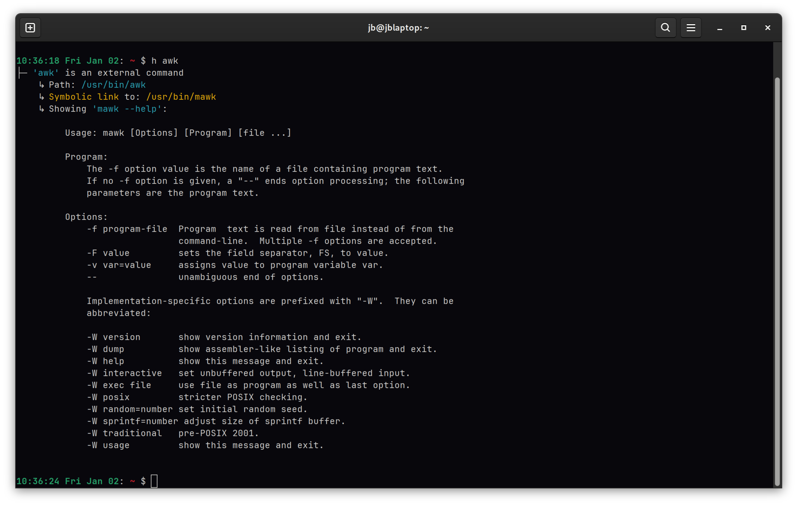
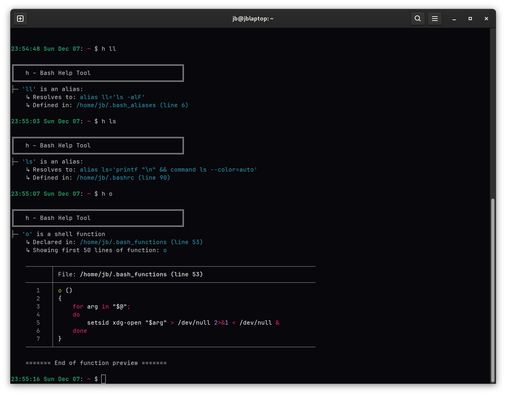
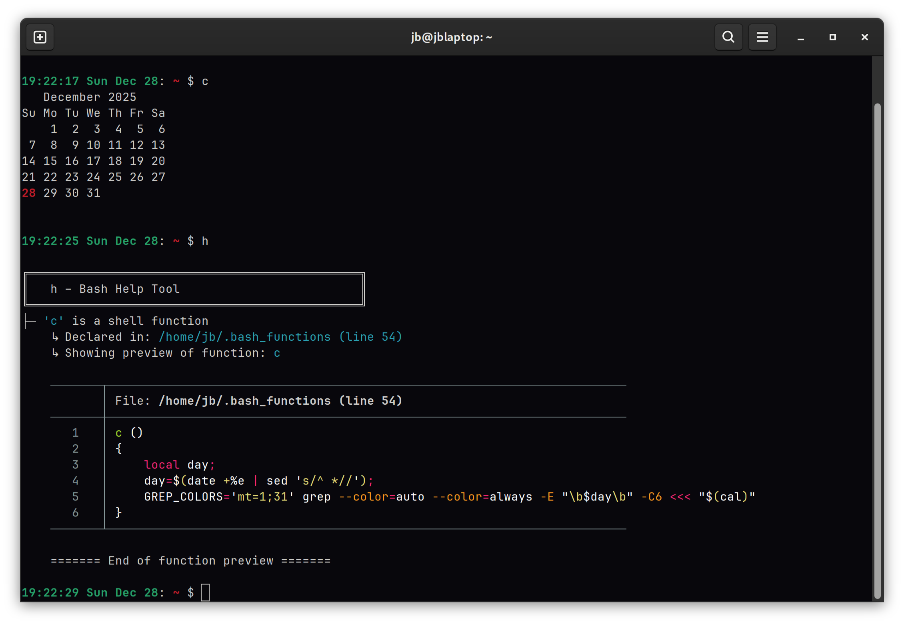
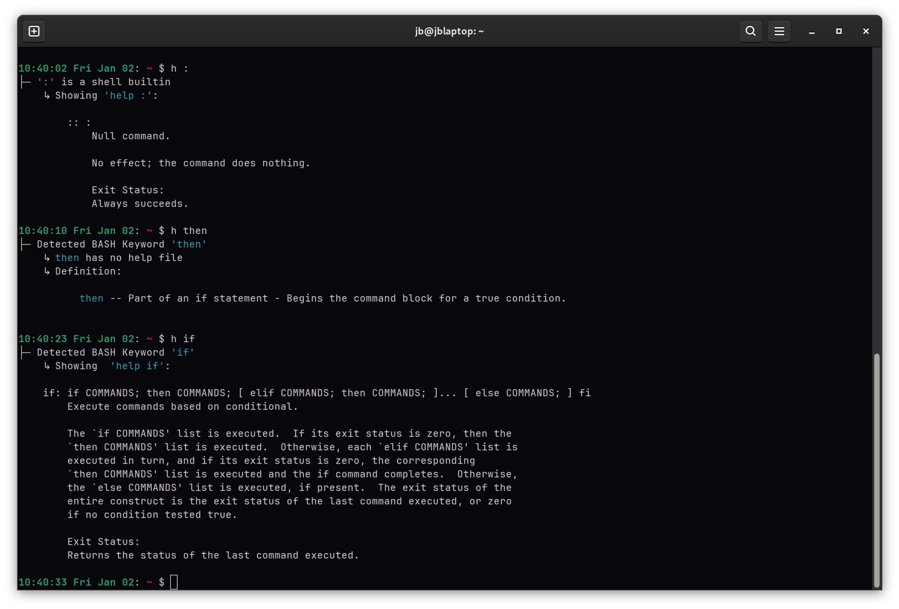
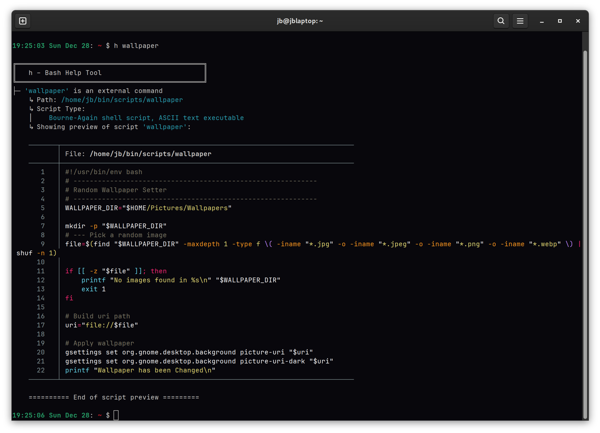
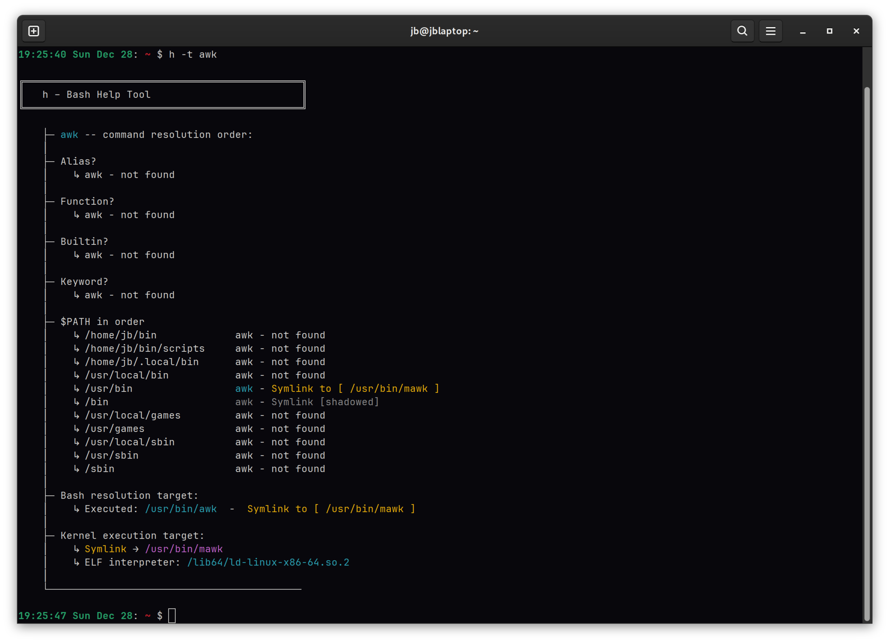

# h — Bash Help Tool

[](LICENSE)
[](https://github.com/JB63134/bash_h/releases)

**h** is a full fledged command resolution engine that unifies help into one shortcut - **h**    
It helps you understand what a command is, and shows available documentation.
  
**h** started out as an alias h='eval "$(history -p !! | awk '''{print $1}''')" --help'
  
I decided to write this version of **h** so that I could get help from multiple sources.  
For binaries '<command> --help', -help, -h, or -?.  
For builtins and some keywords use 'help "command"'  
As a fallback, checks for both man pages and info pages then alerts the user if found        
For aliases, functions and scripts - handle displaying contents.  

## Requirements 

Bash ≥ V4.4 and GNU utils    
Sourced file detection supports debian and fedora / rhel setups 

## Optional dependencies

`fzf` -- for interactive search    
`bat` / `batcat` -- for pretty syntax-highlighting. `h` will fallback to an internal perl script for basic highlighting 

---

## Features

### Command Resolution
- Determines whether a command is:
  - Alias
  - Shell function
  - Builtin
  - Keyword
  - External file/script
- Provides context (e.g., file location, line number, symlink targets).

### Help Output
- Shows help from:
  - `help` for builtins/keywords
  - `--help` / `-h` flags for external commands
  - alerts user of `man` or `info` pages if available

### Script/Function Preview
- Displays the first 50 lines
- Syntax highlighting:
  - Prefers `bat` / `batcat` if installed
  - Otherwise uses embedded Perl for colorized Bash syntax

### Alias Expansion
- Resolves aliases  
- Shows where aliases are defined (interactive shell or sourced file)

### Command Resolution Trace
- `h --trace sed` shows the order Bash would resolve a command  
- Highlights shadowing (e.g., alias overriding a builtin)

### Interactive Command Selection
- If `fzf` is installed, `h -f` lets users pick a command interactively

### Command Resolution Trace
- `_h_print_trace` shows the order Bash would resolve a command  
- Highlights shadowing (e.g., alias overriding a builtin)

---

## Installation

### 1. Manual Installation

Clone the repository.
```bash
# Clone the repository.
git clone https://github.com/JB63134/bash_h.git /usr/local/bin/bash_h

# Source the main script in your .bashrc or .bash_profile
echo "source /usr/local/bin/bash_h/.bash_h" >> ~/.bashrc

# Apply changes immediately
source ~/.bashrc
```


### 2. Debian/Ubuntu `.deb` Package

A quick method for Debian-based systems:

```bash
# Download the latest release
wget https://github.com/JB63134/bash_h/releases/latest/download/h_3.0.52.deb

# Install using dpkg
sudo dpkg -i h_3.0.52.deb

# Verify installation
ca -h
```

---

## Usage

```bash
h                   # Analyze the last executed command
h ls                # Show detailed info about 'ls'
h awk               # Show help, location, and script preview if available
h -f                # Use fzf to select a command interactively
h -t awk            # Shows command resolution order (alias → function → builtin → PATH).  
h -h                # Show usage
h -v                # Show version info
```

### Options

| Option               | Description                                                        |
| -------------------- | ------------------------------------------------------------------ |
| `-h`, `--help`       | Show help text                                                     |
| `-v`, `--version`    | Show version information                                           |
| `-f`, `--fzf`        | Interactively search for commands (requires `fzf`)                 |
| `-t`, `--trace`      | Show detailed trace of command resolution including shadowing      |

---

## Screenshots / Output Preview








--------------------------------------------------------------------------------------------


